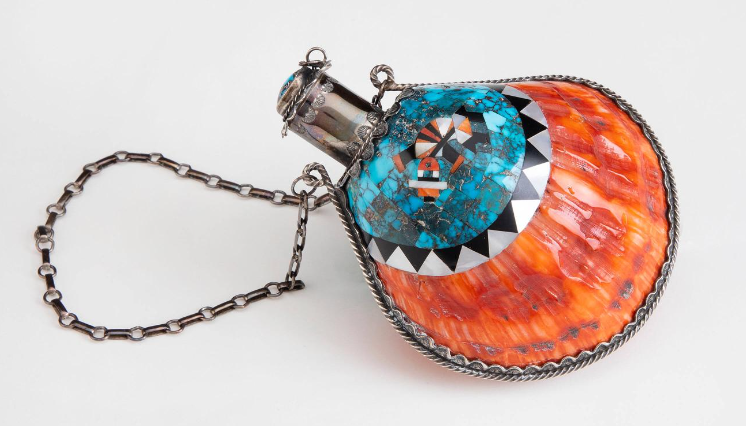

## Field Trip Project

### Project Summary

This project aims to promote indigenous art through a interactive drawing page that mirrors the aesthetics of native jewelry art. The user would be able to click to influence a geometric 2-Dimensional construction, and select different modifiers like shape and color.

### Core Webpages

- Landing page
  - Greets the user, and allows them to click a big button to begin or to scroll and view artifacts
- Artifacts viewer
  - A section of the landing page dedicated to showing off this kind of art, giving credit to the artist, information about its creation, and the meaning behind it.
- Interactive portion
  - This would be what the user interacts with after clicking the "begin" button on the landing page. This is where the fun artsy part happens. The user can select tool options, like drawing a boundary or changing the geometric shape used.

### Design Choices

Relevant artpiece from the Eiteljorg: 

- The main inspirations for arty aspect of this are https://mondrianandme.com/ and http://weavesilk.com/
- The site should align with the main Eiteljorg page's design choices https://eiteljorg.org/
  - Prominent orange highlight color, white background.

- The actual technology behind this project would be standard HTML, CSS, and some kind of graphics JS library, like P5.JS or Three.js